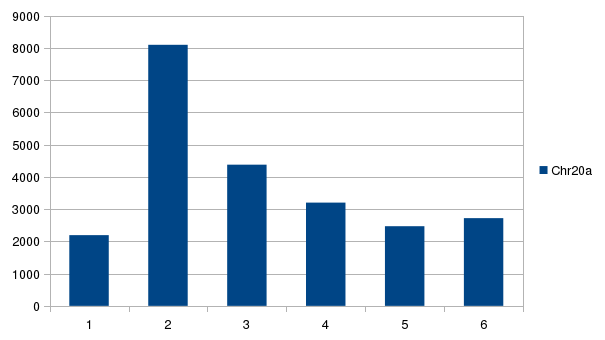
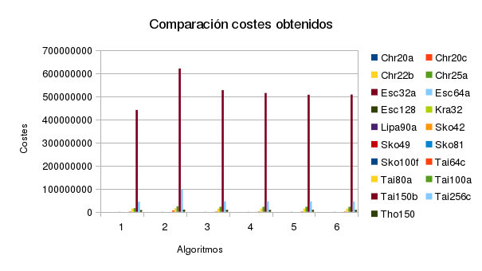
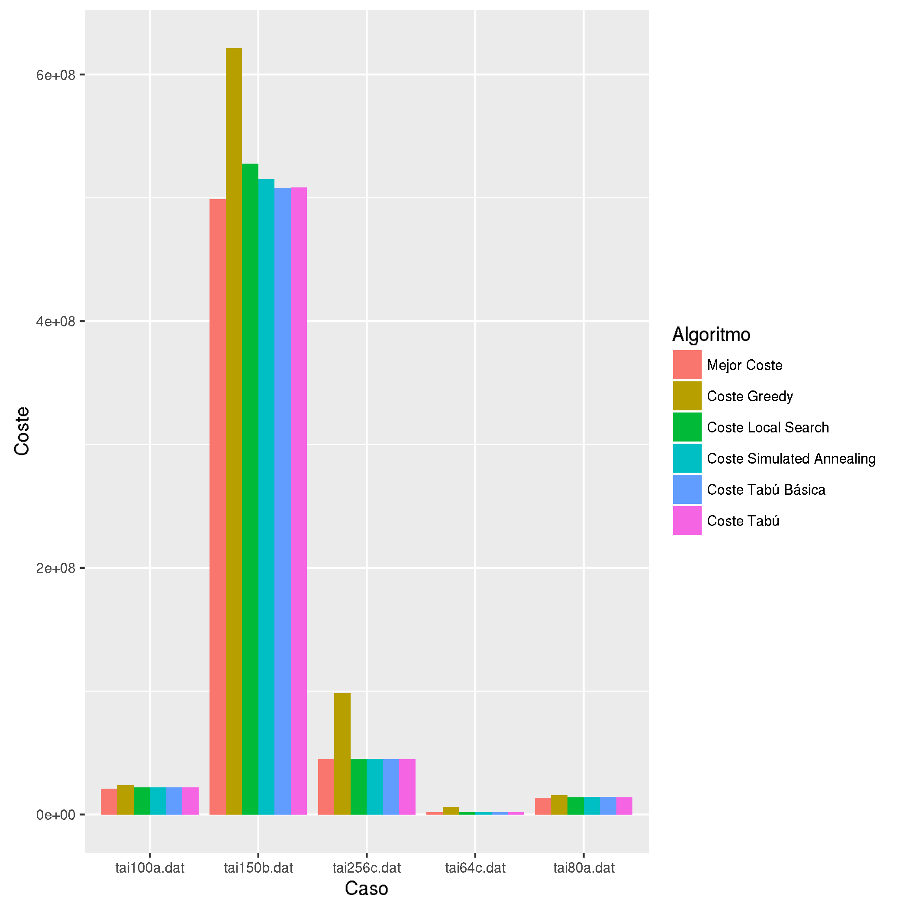
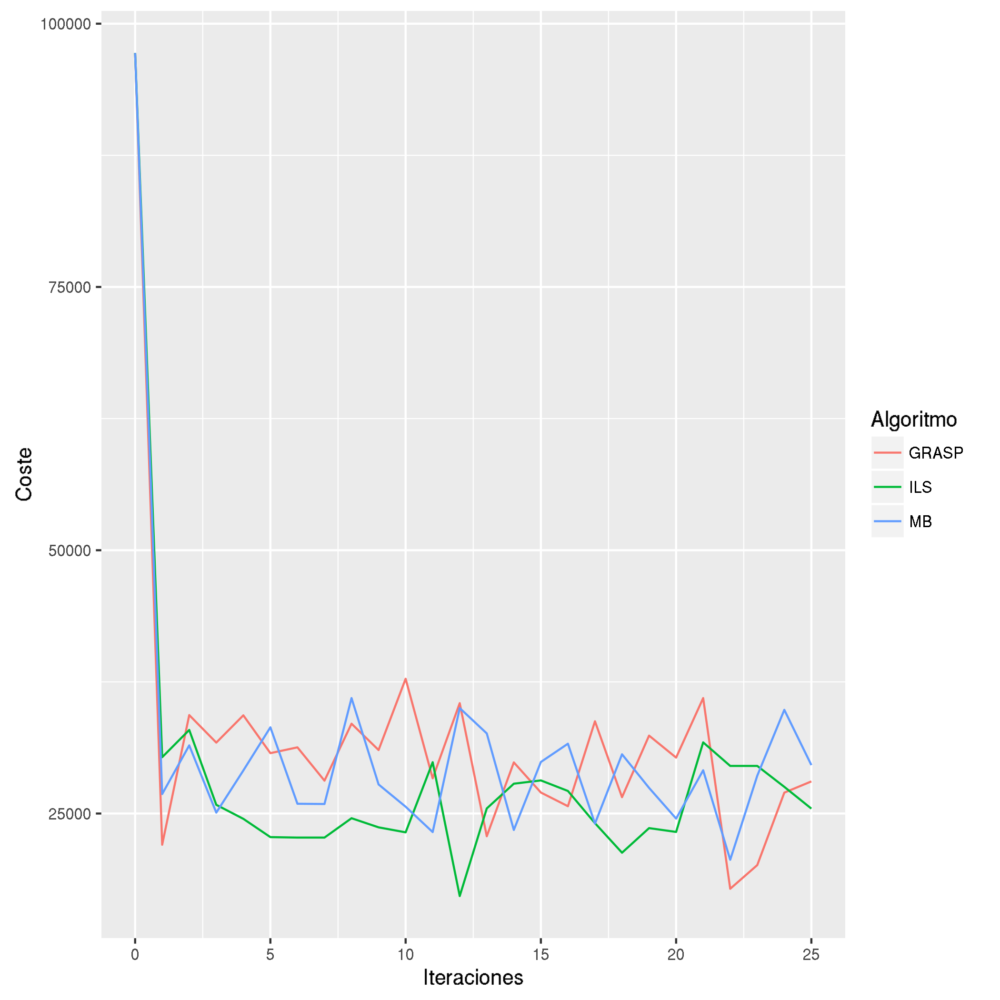

# Análisis de Resultados con R y Python
Cómo pasé de analizar resultados con Excel a analizarlos con R+Python

## Cómo empezó todo...

Todo empezó cuando me mandaron hacer una práctica para la univerdad en la que tenía que:

* Desarrollar cuatro algoritmos diferentes.

* Ejecutarlos en 20 casos diferentes, desde tamaño  hasta tamaño .

* Hacer una documentación explicando el problema a resolver, cada algoritmo desarrollado e incluyendo un pseudocódigo de los mismos.

* Incluir en dicha documentación un estudio estadístico de los resultados, valorando cada algoritmo en función de cómo había trabajado con casos grandes ( grande) o casos pequeños ( pequeño) y sobre la eficacia del algoritmo en comparación con el mejor resultado conocido y con los resultados obtenidos por el resto de algoritmos. Además, incluir gráficas que apoyaran tus conclusiones estaba "muy bien visto" (codo, codo, guiño guiño).

y todo esto en unas tres semanas aproximadamente.

### Dormida en los laureles

Empecé con bastante tranquilidad pensando que en dos semanas tendría todo el trabajo hecho y me quedaría otra semana extra para documentar. A la hora de realizar los algoritmos me encontré con algunos fallos y varios quebraderos de cabeza, pero pude tenerlos todos terminados en esas dos semanas. Empecé a hacer mi documentación explicando con todo detalle todo lo que había hecho, centrándome en obtener tanto una buena presentación como una buena redacción y, finalmente, me quedaron dos días para hacer lo más importante: el análisis de los resultados. 

Para hacer el análisis, el profesor nos había dejado preparada una hoja de cálculo _plantilla_ con todos los datos que teníamos que rellenar y calcular. En rellenar la maldita plantilla se me fue media mañana, por no decir la mañana entera, ya que en _Calc_ tienes que introducir los decimales con una coma y _Python_ los devolvía con un punto. A pesar de esto aún no cundía demasiado el pánico pues tenía otro día más. 

Cuando ya calculé con _Calc_ todo lo que había que calcular vino __el problema__: poner todos los datos que había calculado en mi documento de LaTeX. Un amigo me pasó un script que te permite exportar la tabla con sintaxis `tabular` de LaTeX pero, en la hoja de cálculo tenía las tablas que había hecho para todos y cada uno de los algoritmos y en mi documento tenían que ir separadas en secciones. Al final después de pelearme con _Calc_ conseguí separar las tablas e incluirlas en mi documento, pero había perdido un precioso día para documentar y analizar los resultados que había estado __todo el día__ preparando.

### Último día. Kernel panic.

Llegó el último día que, como tenía clase por la tarde, era en realidad _la última mañana_. Decidí que sería una buena idea poner gráficas en mi documentación, pues con las tablas no me había dado como para escribir _todo lo que me hubiese gustado_ y además, le darían a mi documento un extra de "profesionalidad". 

Así que me dispuse a intentar generar un gráfico en la hoja de cálculo que tenía. Intenté todas las combinaciones posibles de datos, tipos de gráficos, colores, leyendas y demás herramientas que proporciona _Calc_ para hacer gráficos y con ninguna obtenía un buen gráfico que realmente reflejase lo que quería. De hecho, lo más decente que pude obtener fueron dos gráficos que no decían absolutamente nada sobre los datos y que no supe ni siquiera etiquetar... supongo que por los nervios de que la entrega se aproximaba y mi análisis daba pena.

Estos son los gráficos que finalmente incluí en la que iba a ser la chachi documentación extra profesional a 5 minutos de que la entrega se cerrase.





¿Podéis sacar alguna conclusión de ellos? Yo no.

## Cuello de botella

Tras el gran desastre que hice en la primera práctica, me prometí que no me pasaría lo mismo en la segunda. Tras un rato de reflexión, me di cuenta de que mi principal problema fue el tiempo que __gasté__ metiendo datos en la hoja de cálculo a mano e intentando hacer una gráfica medio decente. Tareas tediosas y, sobre todo, que podría haber automatizado con un script. 

Empecé a investigar cómo podría hacer un equivalente a mi hoja de cálculo, pero _exportable_ a LaTeX y sin tener que usar _Calc_. Fue entonces cuando encontré el maravillo paquete de _Python_ llamado `tabulate`. Este paquete, te permite generar a partir de una _lista de listas_ una preciosa tabla en varios formatos (podéis consultarlos en su [documentación](https://pypi.python.org/pypi/tabulate)) entre los que se encontraba `tabular` de LaTeX. 

Tuve la suerte de haber hecho mi práctica en _python_, por lo que añadirle el script que voy a describir a continuación fue pan comido. 

## Mi script con `tabulate`

Si habéis leído la documentación de `tabulate` habréis visto que es bastante sencillo de usar: sólo hay que hacer una lista de listas, donde cada lista de la lista representa una fila de la tabla. En mi caso, la información que tenía que almacenar para cada algoritmo era: 

| Caso | Coste obtenido | Tiempo de ejecución | Desviación |
|:----:|:--------------:|:-------------------:|:----------:|
|      |                |                     |            |

La última columna era una forma de reflejar la diferencia del coste obtenido por el algoritmo con el mejor coste obtenido para ese caso del problema.

Mi script consistió en ejecutar todos los casos del algoritmo y guardar dos medidas, en dos listas separadas: tiempo de ejecución y coste de la solución obtenida. De antemano tenía guardados los distintos casos que tenía que ejecutar y las mejores soluciones conocidas de cada algoritmo, que usé para calcular la desviación de cada solución con la siguiente fórmula:


Una vez tenía estos datos, generé la tabla en formato LaTeX consultando las diferentes listas que había creado. 

```python
def imprime(self):
    # Calculamos la desviación de cada solución con respecto a la mejor
    self.calcula_desv()
    # Generamos cada fila de la tabla accediendo a los datos guardados en cada
    # una de las listas 
    table = [[self.ficheros[i], self.valores[i], self.tiempos[i], 
        self.desviaciones[i]] for i in range(len(self.ficheros))]
    # Añadimos a la tabla una cabecera para cada columna
    print(tabulate(table, headers=["Fichero", "Coste", "Tiempo", "Desviación"], 
        tablefmt="latex"))
    # Además, calculamos la desviación media y el tiempo medio de ejecución
    print("Desviación = ",self.desv())
    print("Tiempo = ",self.tiempo())
```

## Y los gráficos, ¿qué?

Una vez tuve mi script "hoja de cálculo" hecho, pasé a pensar cómo podría automatizar la creación de los gráficos que yo quería. Justo por esa época, @JJ dio una [charla](http://jj.github.io/data-vis/#/) sobre _Visualización de datos con R_ en la que describía el paquete `ggplot2`. El funcionamiento de `ggplot2` es muy sencillo, y permite obtener gráficos muy bonitos e ilustrativos a partir de un _Data frame_. 

Antes de describir el script en R que hice, quiero enseñaros los gráficos que obtuve para que los comparéis con los que obtuve con _Calc_.




¿Qué algoritmo funciona mejor en casos pequeños? ¿Y en casos grandes?



Este último gráfico lo hice con los datos de la práctica 2, en vez de con los de la práctica 1. Representa la convergencia a una solución, al ser algoritmos multiarranque, pueden llegar a una buena solución y después dar con otra peor. ¿Qué algoritmo da con la mejor solución? ¿Qué algoritmo converge más rápido?

## Mi script con `ggplot2`

### Pasando datos de Python a R

`ggplot2` era ideal, pero tenía un problema: ¿cómo paso mis datos de python a R? La respuesta no fue muy difícil de encontrar. Lo que hice fue añadir una función más a mi script en python que guardaba los datos de la "hoja de cálculo" en un fichero `csv`. Con el fichero `csv` de cada algoritmo, creaba un _Data frame_ en R con los datos que me interesaban para mi gráfica.

```python 
def csv(self):
    with open("Resultados/"+self.nombre_csv, 'w') as csvfile:
        fieldnames = ["Coste","Tiempo","Desviacion"]
        writer = csv.DictWriter(csvfile, fieldnames=fieldnames)
        writer.writeheader()
        for i in range(len(self.ficheros)):
            writer.writerow({'Coste':str(self.valores[i]), 
                'Tiempo':str(self.tiempos[i]), 'Desviacion':str(self.desviaciones[i])})
    csvfile.close()
```
Como también representaba en la gráfica los mejores resultados conocidos para cada caso, hice un `csv` para almacenarlos y poder leerlos con R. Esta función sólo tuve que ejecutarla una vez pues la mejor solución de cada caso es la misma la compares con el algoritmo que la compares.

```python
def mejor_csv(self):
    with open("mejor_csv.csv", 'w') as csvfile:
        fieldnames = ["Caso","Coste"]
        writer = csv.DictWriter(csvfile, fieldnames=fieldnames)
        writer.writeheader()
        for i in range(len(self.ficheros)):
            writer.writerow({'Caso':self.ficheros[i].split("/",1)[1], 
                'Coste':str(self.mejores_sol[i])})
    csvfile.close()
```

### Representando en R los datos

Una vez tenía los datos en ficheros `csv` sólo tenía que usar la función `read.csv` para convertirlos en un _Data frame_. En mi caso, como habréis visto en las gráficas, sólo estaba interesada en el coste obtenido por cada algoritmo en casos pequeños y grandes, por lo que obivé los datos relacionados con el tiempo de ejecución.

```r
# Parámetros de la función:
#   resultados: nombre de los ficheros csv de cada algoritmo
#   nombres: nombres de las columnas en el data frame
construye_datos <- function(resultados, nombres) {
    # leemos los datos sobre los mejores costes obtenidos para cada caso
    mejor <- read.csv('Resultados/mejor_csv.csv')
    # y los costes obtenidos por el algoritmo greedy, este algoritmo se compara
    # con todos los algoritmos desarrollados en todas las prácticas.
    greedy <- read.csv('Resultados/resultados_greedy.csv')
    # leemos el resto de datos de los algoritmos de la práctica concreta
    algoritmos <- lapply(X=resultados, FUN=function(r) read.csv(paste("Resultados/", r, sep="")))
    # hacemos un data frame guardando únicamente el coste obtenido por cada
    # algoritmo.
    d <- data.frame(cbind(mejor, greedy, algoritmos))
    names(d) <- c("Caso", "MejorCoste", "CosteGreedy", "TiempoGreedy", "DesvGreedy", nombres)
    d
}
```
Una vez tenía un _Data frame_ con los datos que quería representar en la gráfica, pasaba a realizar la gráfica con otra función. Debido a que quería representar tres medidas diferentes en la gráfica (__coste__ obtenido por cada __algoritmo__ en algunos de los __casos__), tuve que hacer un tratamiento previo al _Data frame_ para conseguirlo. 

La función `construye_datos` aplicada sobre dos algoritmos _"Ejemplo 1"_ y _"Ejemplo 2"_ nos devuelve un _Data frame_ con la siguiente forma:

| Caso | MejorCoste | CosteGreedy | TiempoGreedy | DesvGreedy | CosteEj1 | TiempoEj1 | DesvEj1 | CosteEj2 | TiempoEj2 | DesvEj2 |
|:----:|:----------:|:-----------:|:------------:|:----------:|:--------:|:---------:|:-------:|:--------:|:---------:|:-------:|
|      |            |             |              |            |          |           |         |          |           |         |

De esos datos, como he dicho antes, sólo nos interesan los relativos al coste obtenido para cada caso. Por tanto, el primer "procesamiento" que debemos hacer al _Data frame_ es quedarnos sólo con las columnas que nos interesan:

| Caso | MejorCoste | CosteGreedy | CosteEj1 | CosteEj2 |
|:----:|:----------:|:-----------:|:--------:|:--------:|
|      |            |             |          |          |

Una vez hecho esto, tenía que "reorganizar" el _Data frame_ de forma que pasase a tener únicamente 3 columnas, que son las que iba a representar en la gráfica:

|    Caso    |   variable  | value |
|:----------:|:-----------:|:-----:|
| chr20a.dat |  MejorCoste |  2192 |
| chr20c.dat |  MejorCoste | 14142 |
| chr22b.dat |  MejorCoste |  6194 |
| chr25a.dat |  MejorCoste |  3796 |
| chr20a.dat | CosteGreedy |  8100 |
| chr20c.dat | CosteGreedy | 78718 |
| chr22b.dat | CosteGreedy | 11942 |
| chr25a.dat | CosteGreedy | 17556 |
| chr20a.dat |    CosteEj1 |  2418 |
| chr20c.dat |    CosteEj1 | 15672 |
| chr22b.dat |    CosteEj1 |  6530 |
| chr25a.dat |    CosteEj1 |  4762 |
| chr20a.dat |    CosteEj2 |  2546 |
| chr20c.dat |    CosteEj2 | 16986 |
| chr22b.dat |    CosteEj2 |  6660 |
| chr25a.dat |    CosteEj2 |  4440 |

Como veis, usando la columna _Caso_ como __identificador__, hemos reordenado la tabla de manera que, para cada algoritmo, tendremos un gráfico de barras representando el coste obtenido en cada caso.

Una vez explicado paso a paso el tratamiento que hice a los datos, paso a enseñar la función que hace la gráfica:

```r
# Parámetros de la función:
#   datos: Data frame que devuelve la función constuye_datos
#   cols: columnas del data frame que vamos a representar en la gráfica 
#         (en nuestro caso, el coste obtenido por cada algoritmo para cada caso)
#   nombres: nombres de cada columna del data frame que aparecerán en la gráfica
#   file: nombre del archivo en el que guardaremos las gráficas finalmente
representa_datos <- function(datos, cols, nombres, file) {
    # importación de librerías
    library(ggplot2)    # para hacer gŕaficos
    library(reshape2)   # para poder redistribuir el data frame
    # nos quedamos con las columnas del data frame que nos interesan
    d_c <- data.frame(cbind(datos[,cols]))
    names(d_c) <- c("Caso", "Mejor Coste", "Coste Greedy", nombres)
    d_c$Caso = datos$Caso
    # filtramos los casos que empiezan por chr2, ya que estos son casos
    # bastante pequeños y redistribuimos el data frame
    d_chr <- melt(d_c[grepl("chr2",datos$Caso),])
    names(d_chr)  <- c("Caso", "Algoritmo", "Coste")
    # representamos la gráfica de barras
    ggplot(d_chr, aes(Caso, Coste)) + geom_bar(aes(fill=Algoritmo), position="dodge", stat="identity")
    # guardamos el archivo
    ggsave(paste("chr",file,".png",sep=""))
    # repetimos para casos tai, que son casos grandes.
    d_tai <- melt(d_c[grepl("tai",datos$Caso),])
    names(d_tai) <- c("Caso", "Algoritmo", "Coste")
    ggplot(d_tai, aes(Caso, Coste)) + geom_bar(aes(fill=Algoritmo), position="dodge", stat="identity")
    ggsave(paste("tai",file,".png",sep=""))
}
```
Por ejemplo, para obtener la gráfica de los algoritmos _"Ejemplo 1"_ y _"Ejemplo 2"_, realizaríamos la siguiente llamada:

```r
datos_prueba <- construye_datos(resultados = c("resultados_Ej1.csv","resultados_Ej2.csv"),
    nombres = c("CosteEj1", "TiempoEj1", "DesvEj1","CosteEj2", "TiempoEj2", "DesvEj2"))
representa_datos(datos=datos_prueba, cols=c(1,2,3,6,9), nombres=c("Coste Ej1", "Coste Ej2), file="prueba")
```

Conseguí optimizar tanto el tiempo con estos scripts, que me sobró tiempo para implementar un gráfico de convergencia en R. Para ello, modifiqué mi práctica para que guardase en un `csv` cada coste que iba encontrando, para después representarlo en una gráfica. Una vez comprendida la función anterior, esta no tiene apenas ninguna diferencia:

```r
representa_convergencia <- function(resultados, nombres, file) {
    library(ggplot2)
    library(reshape2)
    # leemos la convergencia de cada algoritmo
    convergencias <- lapply(X=resultados, FUN=function(r) read.csv(paste("Resultados/",r,sep="")))
    # El csv guarda tanto las iteraciones dadas por el algoritmo como el coste
    # obtenido en cada iteración. Como sólo nos interesa el coste, nos quedamos
    # con la segunda columna.
    c <- lapply(X=convergencias, FUN=function(conv) conv[[2]])
    # hacemos un nuevo data frame con la siguiente estructura:
    #   Iteraciones    ConvergenciaAlgoritmo 1 ..... ConvergenciaAlgoritmo n  
    d_c <- data.frame(convergencias[[1]][,1],c)
    names(d_c) <- nombres
    d_c
    # reorganizamos el data frame
    d_cm <- melt(d_c, id.vars=nombres[1])
    names(d_cm) <- c(nombres[1], "Algoritmo", "Coste")
    # lo representamos con ggplot. Hago la distinción de si los datos se han
    # obtenido por número de llamadas a la función de evaluación o por número de
    # iteraciones.
    if (nombres[1] == "Evaluaciones") 
        ggplot(d_cm, aes(Evaluaciones,Coste)) + geom_line(aes(color=Algoritmo))
    else
        ggplot(d_cm, aes(Iteraciones,Coste)) + geom_line(aes(color=Algoritmo))
    # y lo guardamos.
    ggsave(paste("conver",file,".png", sep=""))
}
```
